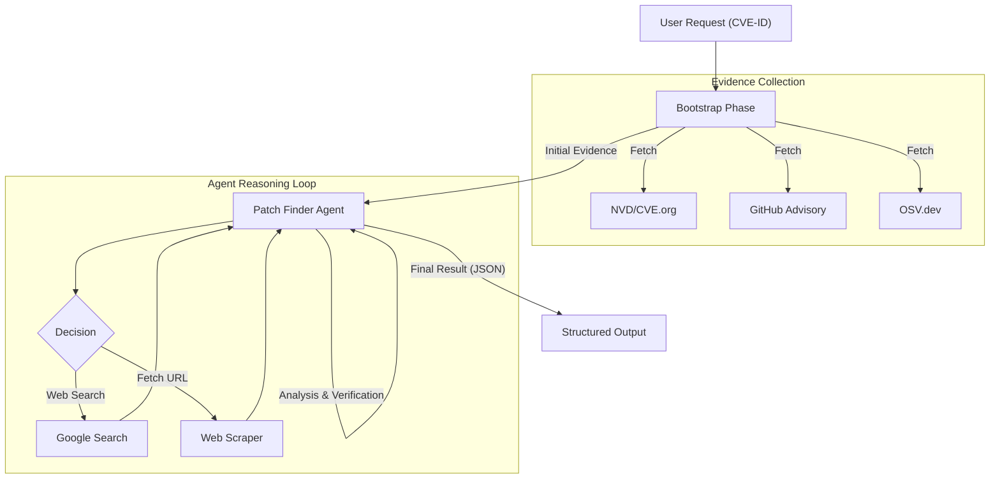

# Patch Finder Agent


[](https://opensource.org/licenses/Apache-2.0)

**Patch Finder** is an autonomous AI agent designed to locate upstream fix commits for security vulnerabilities (CVEs). It orchestrates public data sources, intelligently searches the web, and verifies findings to pinpoint the exact code changes that resolve a security issue.

### Architecture

Patch Finder implements a **Bootstrap-First** architecture. Before the AI agent starts, a deterministic "Bootstrap Phase" pre-fetches authoritative data to ground the agent's reasoning. The LLM then orchestrates a search loop to fill in missing details (like finding the specific commit hash referenced in a bug report).



### Components

1.  **Bootstrap Module**: The grounding engine.
    *   **Role**: Automatically queries NVD, OSV, and GitHub Security Advisories *before* the agent starts. This ensures the agent has ground-truth headers, references, and descriptions immediately.

2.  **Patch Finder Agent**: The core intelligence.
    *   **Role**: Analyzes the "Bootstrapped" evidence to form a search strategy. It uses tools to find the actual code change when standard advisories only link to bug reports or generic landing pages.
    *   **Verification**: The agent internally verifies candidate commits against the authoritative data (e.g., "Does this commit match the NVD description?").

3.  **Tools & Capabilities**:
    *   **Web Search**: Targeted queries to find bug tracker entries, mailing list discussions, and commit references.
    *   **Fetch URL**: Capable of extracting content from HTML, Git web interfaces (GitHub, GitLab, git.kernel.org), and plain text files.
    *   **Commit Expansion**: Automatically detects and expands commit URLs to verify their content (diffs, messages).

### Features

*   **Automated Authoritative Verification**: Cross-references findings with trusted sources (NVD, OSV) to reduce hallucinations.
*   **Multi-Source Handling**: natively understands GitHub, GitLab, Kernel.org, and Bitbucket commit structures.
*   **Iterative Deep-Dive**: Can follow chains of references (CVE -> Bug Report -> PR -> Commit).
*   **Structured Output**: Returns precise JSON payloads with the fix commit hash, ready for downstream automation.

### Limitations

*   **Publicity Requirement**: The fix must be publicly accessible. Zero-days or private patches cannot be found.
*   **Probabilistic Nature**: Like all LLMs, it may occasionally miss obscure references or hallucinate connections, though verification layers minimize this.
*   **Rate Limits**: heavily relies on Google Search API and external site access.

## Getting Started

### Prerequisites

*   **Python 3.12+**
*   **vLLM Server**: Hosting `openai/gpt-oss-20b` (Requires ~24GB VRAM GPU like RTX 3090/4090).
*   **Google Custom Search JSON API**: API Key and Search Engine ID.

### Installation

1.  **Clone the repository:**
    ```bash
    git clone https://github.com/yourusername/patch-finder.git
    cd patch-finder
    ```

2.  **Install Dependencies:**
    ```bash
    uv venv --python 3.12
    source .venv/bin/activate
    uv pip install -r requirements.txt
    python -m playwright install chromium
    ```

3.  **Configure Environment:**
    Export the required variables (or use a `.env` file):
    ```bash
    export OPENAI_BASE_URL="http://localhost:8000/v1"
    export GOOGLE_API_KEY="<your_key>"
    export GOOGLE_CSE_ID="<your_cse_id>"
    ```

### Usage

1.  **Start vLLM:**
    ```bash
    vllm serve openai/gpt-oss-20b --port 8000
    ```

2.  **Run the Agent:**
    ```bash
    python agent_runner.py CVE-2023-1234
    ```

    **Output:**
    ```json
    {
      "cve_id": "CVE-2023-1234",
      "commit_hash": "72a4c6...",
      "description": "Fix buffer overflow in..."
    }
    ```
